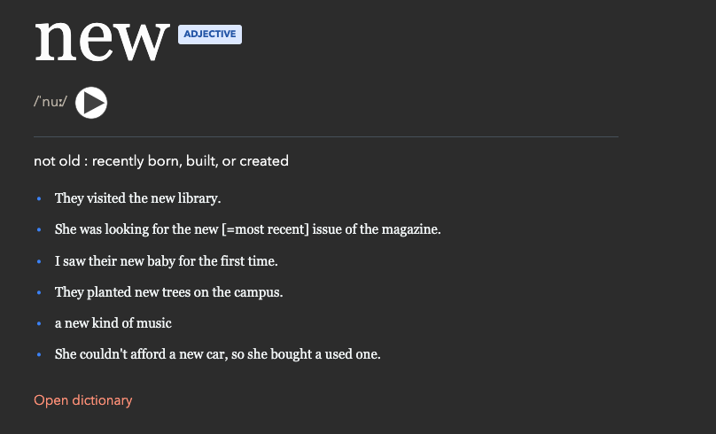

# ankglish

Build a stronger English vocabulary through pronunciation, definitions, and real
example sentences in Anki.

ankglish is designed for learners who want more than a word list:

- Hear each word with packaged pronunciation audio, even when studying offline.
- See IPA, part of speech, clear definitions, and natural usage examples.
- Study atomic cards, so each definition can be learned separately.
- Start with the focused `standard` deck or explore the broader `full` deck.
- Review comfortably in Anki light or dark mode.

## What's included

Each card can contain:

- headword and part of speech;
- IPA pronunciation and a replayable audio button;
- a clear definition;
- several example sentences with readable formatting;
- an optional translation area, hidden unless translations are enabled;
- a link to look up the word in a dictionary.

The deck is built for offline review. Example-sentence TTS is not required, and
translations are not included by default.

## Choose a deck

**Standard** is the smaller starting point. It keeps the most useful entry for
each word, making it easier to build a daily study habit.

**Full** includes every accepted definition with usable pronunciation data. It
is best for learners who want broad coverage or want to search for a specific
meaning.

Both variants are organized by frequency so common vocabulary is easy to find
first.

## Install and import

1. Install [Anki](https://apps.ankiweb.net/).
2. Download `ankglish-standard.apkg` or `ankglish-full.apkg` from the latest
   [GitHub release](https://github.com/UltiRequiem/ankglish/releases).
3. Open the downloaded `.apkg` file, or choose **File > Import** in Anki.
4. Start with the standard deck, or suspend cards you do not want to study.

Anki will import the card templates and audio automatically. No extra plugins,
network connection, or configuration is needed for normal reviews.

## Updates

New releases are refreshed monthly. A release includes both deck variants,
packaged audio, source information, and a build report so the result can be
audited and reproduced.

## Sources and licensing

Frequency ranking uses the `wordfreq` dataset. Definitions, pronunciation
information, and audio primarily come from Merriam-Webster's Learner's
Dictionary, with Wiktionary/Kaikki used where permitted as a fallback. See
[SOURCES.md](SOURCES.md) and [LICENSE](LICENSE) for attribution and reuse terms.
